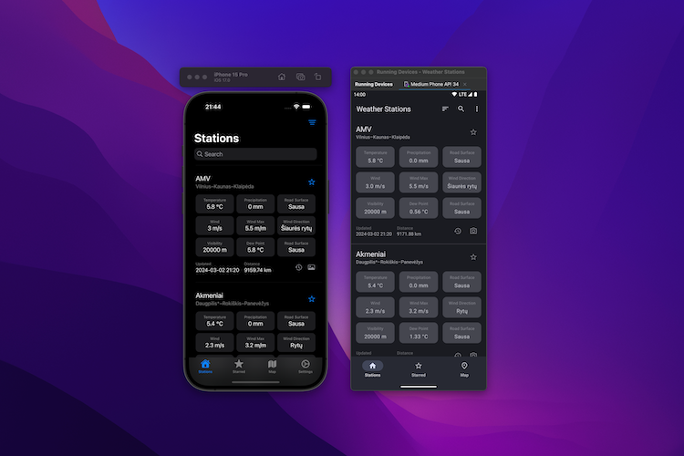

# Weather Stations

Weather Stations is a mobile app that shows live information from road weather stations located in
Lithuania.

## Android App

The Android version of the app is built using the Kotlin programming language and Jetpack Compose framework.

App features:

* View the list of weather stations and filter them by name.
* View weather stations on a map
* Add a weather station to the starred station list to make it easier to find
* Sort stations by distance from the user location
* View historical data
* View live image

[Download](https://play.google.com/store/apps/details?id=com.boatsbay.weather_stations) the app from Google Play Store.

## iOS App

The iOS app is still work in progress 

## Credits

* Application icon is from [Flaticon](https://flaticon.com)
* The weather data comes from [Lithuanian Road Administration](https://lakd.lt)

## License

Weather Stations is free and open-source software released under the [MIT license](https://github.com/tunaitis/weatherstations/blob/master/LICENSE).
